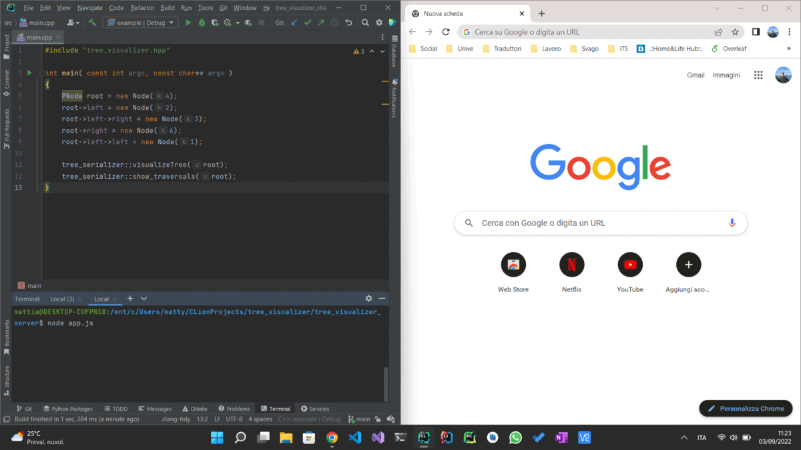

# Tree visualizer

## How it works
The project is client - server web application.
- tree_visualizer_server is a local web server provides an easy way to show your Tree and its traversals.
- tree_visualizer_client is a C++ program that uses an HTTP POST request to send the Tree in a json format to the
tree_visualizer_server 

## Build
### Server side
```bash
cd tree_visualizer_server/
npm install
```

### Client side
```bash
cd tree_visualizer_client/
mkdir build
cd build
cmake ..
make
```

## How to use
### 1) Start "tree_visualizer_server" server
```bash
cd tree_visualizer_server/
node app.js
```

### 2) Use "tree_visualizer_client" header file in your project
see main.cpp in tree_visualizer_client/src folder
```C++
#include "tree_visualizer.hpp"

int main( const int argc, const char** argv )
{
    PNode root = new Node(4);
    root->left = new Node(2);
    root->left->right = new Node(3);
    root->right = new Node(6);
    root->left->left = new Node(1);

    tree_serializer::visualizeTree(root);
    tree_serializer::show_traversals(root);
}
```

### 3) Click on "Get Tree" or "Get traversals"

## Use
